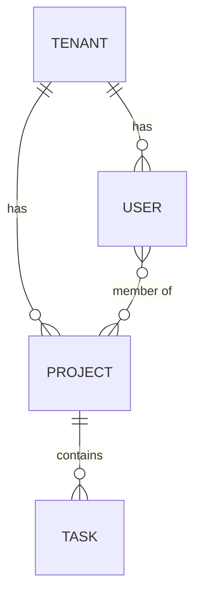

# Data Model Design Skill

Interactive workflow for designing database schemas, generating migrations, and creating repository interfaces for multi-tenant SaaS applications.

## Workflow

### Step 1: Identify Entities and Relationships

Analyze the feature requirements to identify:
- **Entities**: Core data objects (e.g., User, Project, Invoice)
- **Relationships**: One-to-one, one-to-many, many-to-many
- **Aggregate roots**: Which entities are accessed independently vs. through a parent?
- **Value objects**: Embedded data that doesn't have its own lifecycle

Output: Entity relationship diagram in Mermaid format.



### Step 2: Design Tables with Multi-Tenant Columns

For each entity, design the table following `.claude/rules/data-patterns.md`:

Every table MUST include the base entity fields:
- `id` (UUID, primary key)
- `tenant_id` (UUID, NOT NULL, foreign key to tenants)
- `created_at` (TIMESTAMPTZ, NOT NULL, DEFAULT now())
- `updated_at` (TIMESTAMPTZ, NOT NULL, DEFAULT now())
- `deleted_at` (TIMESTAMPTZ, nullable for soft delete)
- `created_by` (UUID, foreign key to users)
- `updated_by` (UUID, foreign key to users)

Plus entity-specific columns with proper types, constraints, and defaults.

Output: Complete table definitions with column types and constraints.

### Step 3: Define Indexes and Constraints

For each table, define:
- **Primary key**: UUID (default gen_random_uuid())
- **Foreign keys**: All relationships with ON DELETE behavior
- **Unique constraints**: Business uniqueness rules (e.g., `UNIQUE(tenant_id, email)`)
- **Indexes**: Foreign keys, common query patterns, search fields
- **Check constraints**: Enum validation, range validation
- **Partial indexes**: Active-only queries (`WHERE deleted_at IS NULL`)

Rules:
- Every foreign key MUST have an index (Postgres doesn't auto-create them)
- Composite indexes: most selective column first
- Use `CREATE INDEX CONCURRENTLY` for large tables

Output: Index and constraint definitions.

### Step 4: Generate Migration Files

Generate migration files following safe migration patterns:

**Up migration** (`YYYYMMDDHHMMSS_description.up.sql`):
```sql
BEGIN;

CREATE TABLE IF NOT EXISTS {entity} (
    -- columns
);

CREATE INDEX CONCURRENTLY IF NOT EXISTS idx_{entity}_{column} ON {entity} ({column});

-- Row Level Security
ALTER TABLE {entity} ENABLE ROW LEVEL SECURITY;
ALTER TABLE {entity} FORCE ROW LEVEL SECURITY;

CREATE POLICY {entity}_tenant_isolation ON {entity}
    USING (tenant_id = current_setting('app.current_tenant_id')::uuid);

COMMIT;
```

**Down migration** (`YYYYMMDDHHMMSS_description.down.sql`):
```sql
BEGIN;
DROP POLICY IF EXISTS {entity}_tenant_isolation ON {entity};
DROP TABLE IF EXISTS {entity};
COMMIT;
```

Write migration files to the project's migration directory.

### Step 5: Generate Repository Interfaces

Generate repository interfaces for each aggregate root:

**Go:**
```go
type {Entity}Repository interface {
    FindByID(ctx context.Context, id uuid.UUID) (*{Entity}, error)
    List(ctx context.Context, filter {Entity}Filter) (*PagedResult[{Entity}], error)
    Create(ctx context.Context, entity *{Entity}) error
    Update(ctx context.Context, entity *{Entity}) error
    Delete(ctx context.Context, id uuid.UUID) error
}
```

**TypeScript:**
```typescript
interface {Entity}Repository {
    findById(id: string): Promise<{Entity} | null>;
    list(filter: {Entity}Filter): Promise<PagedResult<{Entity}>>;
    create(entity: Create{Entity}Input): Promise<{Entity}>;
    update(id: string, entity: Update{Entity}Input): Promise<{Entity}>;
    delete(id: string): Promise<void>;
}
```

### Step 6: Generate In-Memory Test Implementations

Generate in-memory repository implementations for unit testing:

```go
type mem{Entity}Repository struct {
    mu       sync.RWMutex
    entities map[uuid.UUID]*{Entity}
}

func NewMem{Entity}Repository() *mem{Entity}Repository {
    return &mem{Entity}Repository{
        entities: make(map[uuid.UUID]*{Entity}),
    }
}

func (r *mem{Entity}Repository) FindByID(ctx context.Context, id uuid.UUID) (*{Entity}, error) {
    r.mu.RLock()
    defer r.mu.RUnlock()
    tenantID := tenant.FromContext(ctx)
    e, ok := r.entities[id]
    if !ok || e.TenantID != tenantID || e.DeletedAt != nil {
        return nil, ErrNotFound
    }
    return e, nil
}
```

### Step 7: Validate with EXPLAIN ANALYZE

For key queries (list with filters, lookups by non-primary-key fields), generate EXPLAIN ANALYZE queries to validate index usage:

```sql
EXPLAIN (ANALYZE, BUFFERS, FORMAT TEXT)
SELECT id, name, email, role, created_at
FROM users
WHERE tenant_id = 'test-uuid'
  AND deleted_at IS NULL
  AND role = 'admin'
ORDER BY created_at DESC
LIMIT 50;
```

Check for:
- Index scans (not sequential scans)
- Reasonable buffer hit ratios
- No disk sort spills
- No nested loops on large tables

Present the query plans and any index recommendations.

## Output Files

After completing the workflow, the following files should be created:
- Migration files: `migrations/YYYYMMDDHHMMSS_description.{up,down}.sql`
- Domain models: Entity structs/types
- Repository interfaces: Domain-layer interfaces
- Test implementations: In-memory repositories
- Documentation: ER diagram in the spec
